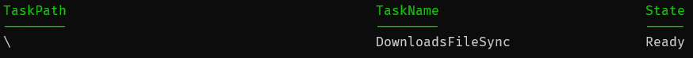

# DownloadsFileSync
Copies and groups files to a target directory for backup

## Setup

Download the powershell file and modify the following variables

required

- $sourcePath
- $destinationPath

optional

- $fileExtensions
- $pattern (regular expression)
- $timeSpan

After that, copy the following command to an administrator powershell terminal, run it and fill the requested entries.

```
Register-ScheduledTask -TaskName DownloadsFileSync -User (Read-Host 'User') -Password ([Runtime.InteropServices.Marshal]::PtrToStringAuto([Runtime.InteropServices.Marshal]::SecureStringToBSTR((Read-Host 'Password' -AsSecureString)))) -RunLevel Highest -Action (New-ScheduledTaskAction  -Execute powershell -Argument "-File $((Read-Host 'Path'))") -Trigger (New-ScheduledTaskTrigger -AtStartup); Start-ScheduledTask -TaskName "DownloadsFileSync"
```

This should be your result:

